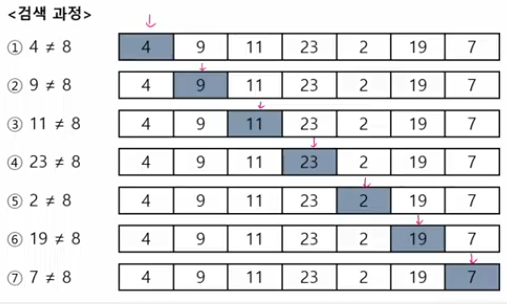
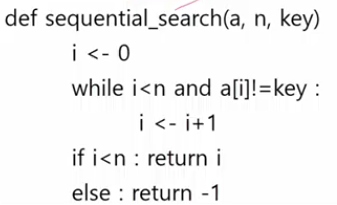
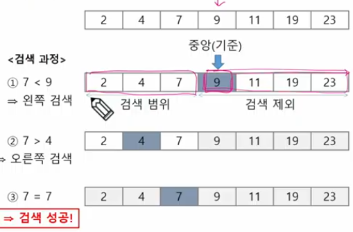

# List2

## 검색
- 저장되어 있는 자료 중에서 원하는 항목을 찾는 작업
- 목적하는 탐색 키를 가진 항목을 찾는 것
  - 탐색 키(search key) : 자료를 구별하여 인식할 수 있는 키
- 검색의 종류
  - 순차 검색(sequential search)
  - 이진 검색(binary search)
  - 해쉬(hash)
### 순차 검색
---
- 일렬로 되어 있는 자료를 순서대로 검색하는 방법
  - 가장 간단하고 직관적인 검색 방법
  - 배열이나 연결 리스트 등 순차구조로 구현된 자료구조에서 원하는 항목을 찾을 때 유용함
  - 알고리즘이 단순하여 구현이 쉽지만, 검색 대상의 수가 많은 경우에는 수행시간이 급격히 증가하여 비효율적임
- 2가지 경우
  - 정렬되어 있지 않은 경우
  - 정렬되어 있는 경우

### 정렬되어 있지 않은 경우
### 검색과정
---
- 첫 번째 원소부터 순서대로 검색 대상과 키 값이 같은 원소가 있는지 비교하며 찾는다.
- 키 값이 동일한 원소를 찾으면 그 원소의 인덱스를 반환한다.
- 자료구조의 마지막에 이를 때 까지 검색 대상을 찾지 못하면 검색 실패

- 찾고자 하는 원소의 순서에 따라 비교회수가 결정된다.
  - 첫 번째 원소를 찾을 때는 1번 비교, 두번째 원소 찾을 때는 2번 비교...
  - 정렬되지 않은 자료에서의 순차 검색의 평균 비교 회수
  - (N + 1) / 2
  - 시간 복잡도 : O(n)

### 정렬되어 있는 경우
### 검색과정
---
- 자료가 오름차순으로 정렬된 상태에서 검색을 실시한다고 가정하자.
- 자료를 순차적으로 검색하면서 키 값을 비교하여, 원소의 키 값이 검색 대상의 키 값보다 크면 찾는 원소가 없다는 것이므로 더 이상 검색하지 않고 검색을 종료한다.

## 이진 검색
- 자료의 가운데에 있는 항목의 키 값과 비교하여 다음 검색의 위치를 결정하고 검색을 계속 진행하는 방법
  - 목적 키를 찾을 때까지 이진 검색을 순환적으로 반복 수행함으로써 검색 범위를 반으로 줄여가면서 보다 빠르게 검색을 수행함
- 이진 검색을 하기 위해서는 자료가 정렬된 상태여야 한다.

## 인덱스
- 인덱스라는 용어는 Database에서 유래했으며, 테이블에 대한 동작 속도를 높여주는 자료 구조를 일컫는다.
- Database 분야가 아닌 곳에서는 Look up table 등의 용어를 사용하기도 한다.
- 인덱스를 저장하는데 필요한 디스크 공간은 보통 테이블을 저장하는데 필요한 디스크 공간보다 작다. 왜냐하면 보통 인덱스는 키-필드만 갖고 있고, 테이블의 다른 세부 항목들은 갖고 있지 않기 때문이다.
### 인덱스
---
- 대량의 데이터를 매번 정렬하면, 프로그램의 반응은 느려질 수 밖에 없다.
- 이러한 대량 데이터의 성능 저하 문제를 해결학 위해 배열 인덱스를 사용할 수 있다.
- 데이터베이스 인덱스는 이진 탐색 트리 구조로 되어있다.

## 셀렉션 알고리즘
- 저장되어 있는 자료로부터 k번째 큰 혹은 작은 원소를 찾는 방법을 셀렉션 알고리즘 이라고 한다.
  - 최소값, 최대값 혹은 중간값을 찾는 알고리즘을 의미하기도 한다.
- 선택 과정
  - 셀렉션은 아래와 같은 과정을 통해 이루어진다.
    - 정렬 알고리즘을 이용하여 자료 정렬하기
    - 원하는 순서에 있는 원소 가져오기

## 선택정렬
- 주어진 자료들 중가장 작은 값의 원소부터 차례대로 선택하여 위치를 교환하는 방식
  - 앞서 살펴본 셀렉션 알고리즘을 전체 자료에 적용한 것이다.
- 정렬 과정
  - 주어진 리스트 중에서 최소값을 찾는다.
  - 그 값을 리스트의 맨 앞에 위치한 값과 교환한다
  - 맨 처음 위치를 제외한 나머지 리스트를 대상으로 위의 과정을 반복한다.
- 시간 복잡도
  - O(n^2)

### 반복정렬
---
  - 조건문은 하나씩 추가해준다.

