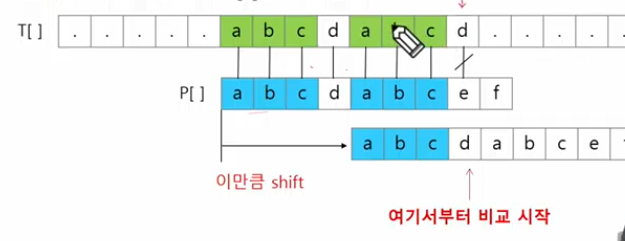
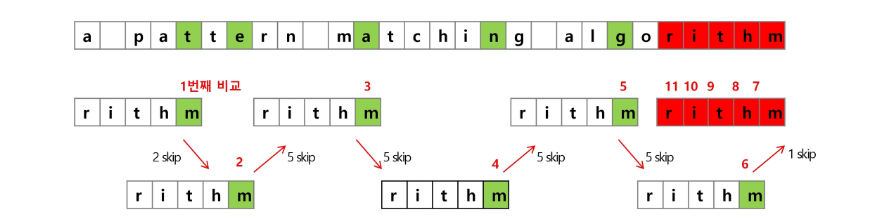
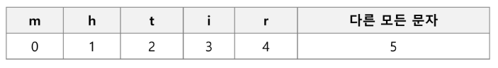

# 문자열(string)

## 패턴 매칭
### 패턴 매칭에 사용되는 알고리즘들
---
- 고지식한 패턴 검색 알고리즘
- 카프-라빈 알고리즘
- KMP 알고리즘
- 보이어-무어 알고리즘

### 고지식한 알고리즘(Brute Force)
---
- 본문 문자열을 처음부터 끝까지 순회하며 비교
``` python
p = "is" # 찾을 패턴
t = "This is a book~!" # 전체 텍스트
m = len(p) # 찾을 패턴의 길이
n = len(t) # 전체 텍스트의 길이

def BruteForce(p, t):
    i = 0 # t의 인덱스
    j = 0 # p의 인덱스
    while j < m and i < n:
        if t[i] != p[j]:
            i = i - j
            j = -1
        i = i + 1
        j = j + 1
    if j == m:
        return i - m # 검색 성공
    else:
        return -1 # 검색 실패
```
### 시간 복잡도
---
- 최악의 경우 시간 복잡도는 텍스트의 모든 위치에서 패턴을 비교해야 하므로 O(MN)
- 길이가 10000인 문자열에서 길이 80인 패턴 찾는다. 최악의 경우 800,000번 비교
- 비교횟수 줄이는 방법?

### KMP 알고리즘
---
- 불일치가 발생한 텍스트 스트링의 앞 부분에 어떤 문자가 있는지를 미리 알고
- 불일치가 발생한 앞 부분에 대하여 다시 비교하지 않고 매칭을 수행
- 패턴을 전처리하여 배열 next[M]을 구해서 잘못된 시작을 최소화한다.
  - next[M] : 불일치가 발생했을 경우 이동할 다음 위치
- 시간 복잡도 : O(M+N)

### 아이디어 설명
---
- 텍스트에서 abcdabc 까지는 매치되고, e에서 실패한 상황 패턴의 맨 앞의 abc와 실패 직전의 abc는 동일함을 이용할 수 있다.
- 실패한 텍스트 문자와 P[4]를 비교한다.

- 매칭이 실패했을 때 돌아갈 곳을 계산한다.

### 보이어-무어 알고리즘
---
- 오른쪽에서 왼쪽으로 비교
- 대부분의 상용 소프트웨어에서 채택하고 있는 알고리즘
- 보이어-무어 알고리즘은 패턴에 오른쪽 끝에 있는 문자가 불일치 하고 이 문자가 패턴 내에 존재하지 않는 경우, 이동 거리는 무려 패턴의 길이만큼이 된다.
### 예시

### rithm 문자열의 skip 배열



### 문자열 매칭 알고리즘 비교
---
- 찾고자 하는 문자열 패턴의 길이 m, 총 문자열 길이 n
- 고지식한 패턴 : 수행시간 O(mn)
- 카프-라빈 알고리즘 : 수행시간 O(n)
- KMP 알고리즘 : 수행시간 O(n)
- 보이어-무어 : 수행시간 O(n) ~ O(mn)


## 문자열 암호화
### 시저 암호
---
- 줄리어스 시저가 사용했다고 하는 암호
- 평문에서 사용되고 있는 알파벳을 일정한 문자 수만큼 [평행이동] 시킴으로써 암호화

### 문자 변환표를 이용한 암호화
### 단일 치환 암호
### bit열의 암호화

## 문자열 압축
### Run-length encoding 알고리즘
### 허프만 코딩 알고리즘