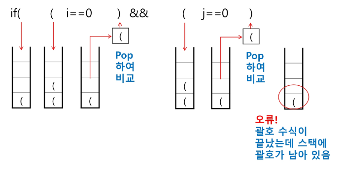

# Stack1

# 순서
## 스택
## 재귀호출
## 재귀호출 연습

## 1. 스택
### 스택의 특성
---
- 물건을 쌓아 올리듯 자료를 쌓아 올린 형태의 자료구조
- 스택에 저장된 자료는 선형 구조를 갖는다.
  - 선형구조 : 자료간의 관계가 1대1의 관계를 갖는다.
  - 비선형구조: 자료간의 관계가 1대N의 관계를 갖는다.
- 스택에 자료를 삽입하거나 스택에서 자료를 꺼낼 수 있다.
- 마지막에 삽입한 자료를 가장 먼저 꺼낸다.
- 후입선출(LIFO, Last-In-First-Out) 이라고 부른다.

### 스택의 구현
---
### 자료구조 : 자료를 선형으로 저장할 저장소
---
  - 배열을 사용할 수 있다.
  - 저장소 자체를 스택이라 부르기도 한다.
  - 스택에서 마지막 삽입된 원소의 위치를 top이라 부른다.
### 연산
---
  - 삽입 : 저장소에 자료를 저장한다. (Push)
  - 삭제 : 저장소에서 자료를 꺼낸다. (PoP)
  - 스택이 공백인지 아닌지를 확인하는 연산. isEmpty
  - 스택의 top에 있는 item(원소)을 반환하는 연산. peek
### 스택의 삽입/삭제 과정
---
- 빈 스택에 원소 A,B,C를 차례로 삽입 후 한번 삭제하는 연산과정

### 스택의 push 알고리즘
---
- append 메소드를 통해 리스트의 마지막에 데이터를 삽입
``` python
def push(item):
    s.append(item)
```

### 스택의 구현(Push 예시)
---
``` python
def push(item, size):
    global top
    top += 1
    if top == size:
        print('overflow!')
    else:
        stack[top] = item

size = 10
stack = [0] * size
top = -1

push(10, size)
top += 1        # push(20)과 같은 역할
stack[top] = 20
```
### 스택의 pop 알고리즘
---
``` python
def my_pop():
    if len(s) == 0:
        # underflow
        return
    else:
        return s.pop()
```

### 스택의 구현(PoP 예시)
---
``` python
def my_pop():
    global top
    if top == -1:
        print('underflow')
        return 0

    else:
        # 함수는 리턴이 나오면 종료되니까 어쩔수 없이 아래와 같이 코드 작성
        top -= 1
        return stack[top + 1]

print(my_pop())

if top > -1: # my_pop()과 같은 역할
    top -= 1
    print(stack[top + 1])
```

### 스택 구현 고려 사항
---
- 1차원 배열을 사용하여 구현할 경우 구현이 용이하다.
- 스택의 크기를 변경하기가 어렵다.
- 따라서 저장소를 동적으로 할당하여 스택을 구현하는 방법이 있다.

### 스택의 응용1 : 괄호검사
---
### - 괄호의 종류 : 대괄호[], 중괄호 {}, 소괄호()
### - 조건
---
  1. 왼쪽 괄호의 개수와 오른쪽 괄호의 개수가 같아야하낟.
  2. 같은 괄호에서 왼쪽 괄호는 오른쪽 괄호보다 먼저 나와야 한다.
  3. 괄호 사이에는 포함관계만 존재한다.

- 스택을 이용한 괄호 검사

> 이때 underflow가 생기는 경우도 고려한다. (ex 스택이 비었을 때)


### 괄호를 조사하는 알고리즘
---
- 여는 괄호를 만나면 push, 닫는 괄호를 만나면 top의 괄호를 pop해주고 비교


### 스택의 응용2 : function call
---
- 프로그램에서의 함수 호출과 복귀에 따른 수행 순서를 관리
- 후입선출 구조
- 함수 수행에 필요한 지역변수, 매개변수, 복귀주소가 들어가 스택 프레임

### 재귀호출
---
- 필요한 함수가 자신과 같은 경우 자신을 다시 호출하는 구조
- 다른함수를 호출하는 것과 같은데 단지 해당 함수가 자신과 똑같이 생긴 것

### 피보나치 수를 구하는 재귀함수
``` python
def fibo(n):

    if n < 2:
        return n
    else:
        return fibo(n - 1) + fibo(n - 2)
```