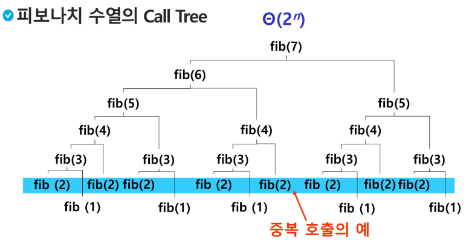
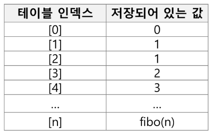

# Stack2
## Memoization
## DP
## DFS

### Memoization
---
- 앞의 예에서 피보나치 수를 구하는 함수를 재귀함수로 구현한 알고리즘은 문제점이 있다.
- **엄청난 중복 호출이 존재한다**는 것이다.

### 피보나치 수열의 Call Tree


### 메모이제이션?
---
- 컴퓨터 프로그램을 실행할 때 이전에 계산한 값을 메모리에 저장해서 매번 다시 계산하지 않도록 하여 전체적인 실행속도를 빠르게 하는 기술이다.

### 메모이제이션 방법을 적용한 알고리즘
``` python
# memo를 위한 배열을 할당하고, 모두 0으로 초기화 한다.
# memo[0]을 0으로 memo[1]는 1로 초기화 한다.
def fibo1(n):
    global memo
    if n >= 2 and memo[n] == 0:
        memo[n] = fibo1(n - 1) + fibo1(n - 2)
    return memo[n]

n = 7
memo = [0] * (n + 1)
memo[0] = 0
memo[1] = 1
fibo1(n)
print(memo)
```

### DP(Dynamic Programming)
---
- 동적 계획 알고리즘은 그리디 알고리즘과 같이 최적화 문제를 해결하는 알고리즘
- 입력 크기가 작은 부분 문제들을 모두 해결한 후에 그 해들을 이용하여 보다 큰 크기의 부분 문제들을 해결하여, 최종적으로 원래 주어진 입력의 문제를 해결하는 알고리즘이다.

### 피보나치 수 DP 적용
---
- 피보나치 수는 부분 문제의 답으로부터 본 문제의 답을 얻을 수 있으므로 최적 부분 구조로 이루어져 있다.
- 부분 문제로 나누는 일을 끝냈으며 가장 작은 부분 문제부터 해를 구한다.


### 피보나치 수 DP 적용 알고리즘
``` python
def fibo2(n):
    f = [0] * (n + 1)
    f[0] = 0
    f[1] = 1
    for i in range(2, n + 1):
        f[i] = f[i - 1] + f[i - 2]

    return f[n]
```