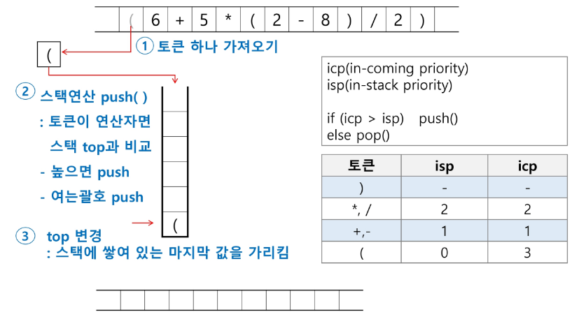
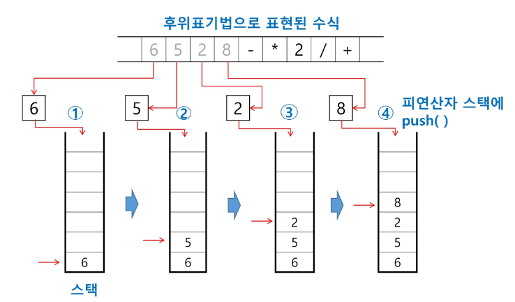
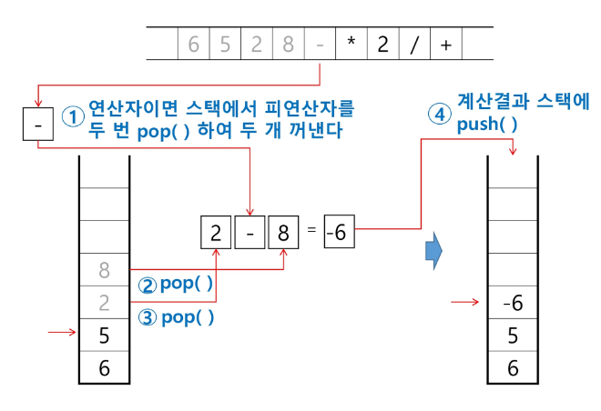
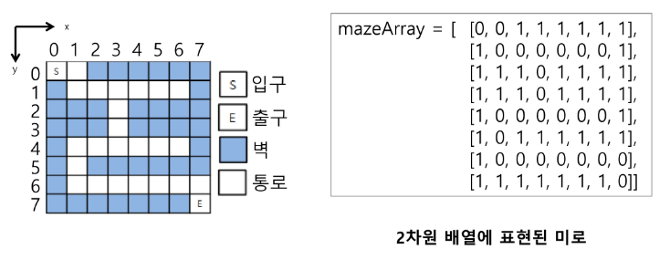
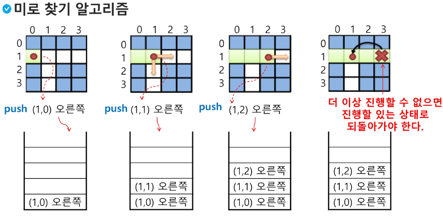
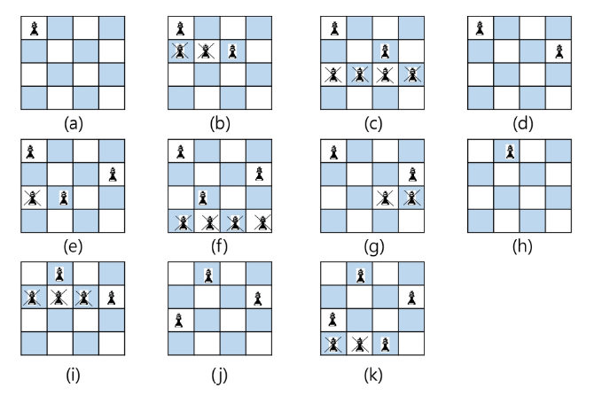
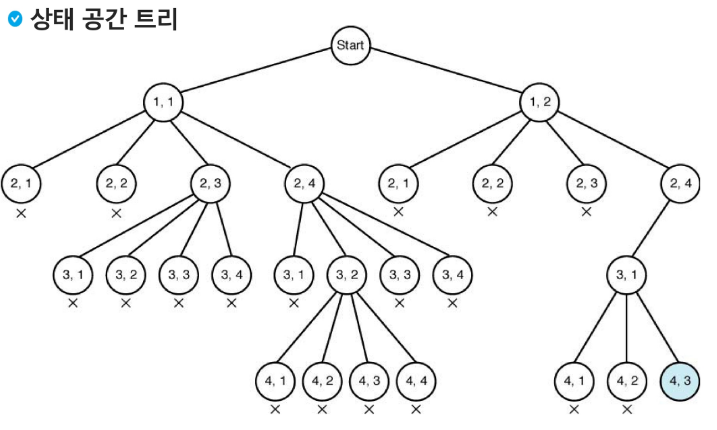

# stack3

## 계산기1
## 계산기2
## 백트래킹


### 계산기1
---
- 문자열로 된 계산식이 주어질 때, 스택을 이용하여 이 계산식의 값을 계산할 수 있다.
- 문자열 수식 계산의 일반적 방법
### 중위표기법
---
- 연산자를 피연산자의 가운데 표기하는 방법 (예 A + B)
### 후위표기법
---
- 연산자를 피연산자 뒤에 표기하는 방법

### 표기과정


### 계산기2
---
- 후위 표기법의 수식을 스택을 이용하여 계산
1. 피연산자를 만나면 스택에 push 한다.
2. 연산자를 만나면 필요한 만큼의 피연산자를 스택에서 pop하여 연산하고, 연산결과를 다시 스택에 push한다.
3. 수식이 끝나면, 마지막으로 스택을 pop하여 출력한다.

### 계산과정




### 백트래킹
---
- 백트래킹 기법은 해를 찾는 도중에 '막히면'(해가 아니면) 되돌아가서 다시 해를 찾아 가는 기법
- 백트래킹 기법은 최적화 문제와 결정 문제를 해결할 수 있다.
- 결정 문제: 문제의 조건을 만족하는 해가 존재하는지의 여부를 yes또는 no가 답하는 문제
  - 미로찾기
  - n-Queen문제
  - Map coloring
  - 부분 집합의 합 문제 등

### 백트래킹과 깊이우선탐색(DFS)과의 차이
---
- 어떤 노드에서 출발하는 경로가 해결책으로 이어질 것 같지 않으면 스탑

### 백트래킹 기법
---
- 어떤 노드의 유망성을 점검 => 유망, 유망하지 않음
- 가지치기(Pruning) : 유망하지 않는 노드가 포함되는 경로는 더 이상 고려하지 않는다.
### 백트래킹 알고리즘
---
1. 상태 공간 트리의 깊이 우선 검색을 실시한다.
2. 각 노드가 유망한지 점검한다.
3. 만일 그 노드가 유망하지 않으면, 그 노드의 부모 노드로 돌아가서 검색을 계속한다.

### 백트래킹 예시 : 미로찾기
---



### 일반 백트래킹 알고리즘
---
> 슈도코드
```
def checknode(v) : # node
    if promising(v):
        if there is a solution at v:
            write the solution
        else:
            for u in each child of v:
                checknode(u)
```


> 위의 알고리즘의 실행 과정


> 상태 공간 트리

